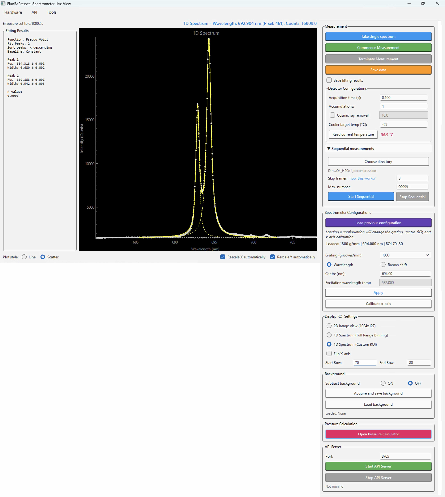

# FluoRaPressée

FluoRaPresséeは、高圧実験で使用することを念頭に置いて開発された、PythonベースのGUIアプリケーションであり、分光器・カメラの制御、データ取得、フィッティング、圧力計算までが一つのアプリケーションで行えます。

特に、一般的な商用ソフトウェアにはない特徴として、

1. **横軸の較正情報を内部的にデータベース化して管理する**機能を備えている。
   特に、回折格子・中心位置が同一の較正情報をグループ化して管理し、デフォルトでは最新の較正情報だけをスピーディーに適用することができる。
   また較正に使用したスペクトルやピーク位置の標準として用いた標準試料の情報なども保存しており、あとから較正に疑義が生じた際にその妥当性を検証できる。
1. 高圧実験における、**蛍光・Ramanスケールを用いた圧力計算に特化した計算プラットフォーム**を備えている。
1. 放射光ビームラインなどにおける、大規模自動化プラットフォームにも組み込めるように、**機器制御・データ取得・解析を外部から行えるAPI**を備えている。

といった点が挙げられます。

## 対応機種

現在、以下の装置構成に対応しています。

- Andor 製カメラ + Andor 製分光器（Kymera / Shamrock）
  - ただし、Andor 製の装置でなくても、Andor Shamrock系の制御プログラムを用いて制御可能な場合があります。Zolix Omni-λ5006iはその例です。
- Princeton Instruments 製カメラ + Acton SPシリーズ分光器
- Ocean Optics製分光器（USB2000/USB4000）

開発段階では、以下の実機を用いて動作確認を行っております。

| 製造元 | 分光器 | 分光器との通信  | 検出器  | 検出器との通信 | 場所 |
| --- | --- | --- | --- |  --- |  --- | 
| Zolix (Andor) | Omni-λ5006i | USB | iVac316 | USB | 東京大学 |
| Andor | Kymera KY-2775 | USB | iDus DV401 | USB | 東京大学 |
| Princeton Instruments | Acton SpectraPro SP-2750 | RS-232C–USB | ProEM 16002 | GigE | BL-18C, PF, KEK |
| Ocean Optics | USB2000 | USB | USB2000 | USB | 東京大学 |

:::caution

Andor SDKおよびPrinceton Instruments PICam Runtimeを利用した装置制御は、原則としてWindows環境を対象としています。

:::

## 関連リンク

- [GitHubリポジトリ](https://github.com/khsacc/FluoRaPressee)
- [不具合・要望の報告](https://github.com/khsacc/FluoRaPressee/issues)

## 謝辞

FluoRaPressée の「分光器の制御からデータ解析まで一つのアプリケーション内で完結させる」というコンセプトは、[Rubycond](https://github.com/CelluleProjet/Rubycond) というソフトウェアに着想を得たものです。
Rubycond は、著者が Stefan Klotz 氏との共同研究のため、フランス・パリ ソルボンヌ大学/CNRS/MNMH 鉱物学・物質物理学・宇宙化学研究所  (Institut de minéralogie, de physique des matériaux et de cosmochimie: IMPMC) に滞在していた際、日常的に使用していたソフトであり、この経験の中で、Raman測定への拡張や、さらに大規模プラットフォームへと組み込める API 付きのアプリケーション開発に関する多くの着想を得ました。
Rubycondの開発者である、Yiuri Garino・Silvia Boccato両氏に感謝申し上げます。

FluoRaPressée は、東京大学大学院理学系研究科附属地殻化学実験施設 地球化学研究室において開発されました。
開発に必要な環境を提供してくださった小松 一生准教授・鍵 裕之教授に感謝申し上げます。
加えて、小松准教授および小谷野蒼大さんには、役にたつフィードバックをたくさんいただきましたことにも感謝申し上げます。

## Developer

Hiroki Kobayashi (Geochemical Research Center, Graduate School of Science, The University of Tokyo).
* Personal Website: https://ice-h.vercel.app
* ORCiD: https://orcid.org/0000-0002-3682-7558
* E-mail as of 2026: hiroki (at) eqchem.s.u-tokyo.ac.jp