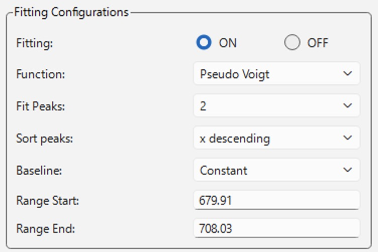

# フィッティング

フィッティングの機能は、メイン画面とAnalysis Modeにそれぞれ実装されています。
フィッティング自体は二つの画面で独立に実行されますが、フィッティングのアルゴリズム自体は共通であり、GUIの操作方法はどちらの画面でも同じです。

**Fitting** ラジオボタンをONにすると設定パネルが有効になり、表示中のスペクトルに対して指定した範囲でフィッティングが実行されます。
以降、スペクトルが更新されるたび（新規測定・連続測定の各フレーム、Analysis Modeでのファイル読み込みや設定変更）に自動的に再フィットされます。
未較正のpixel軸データでもフィッティング自体は可能ですが、圧力計算には波長またはRaman shiftでの較正が必要です（[圧力計算](pressure-calculation/index.md)を参照）。

## フィット関数

**Function** で選べる関数は次の5種類です。

| 関数 | パラメータ | 定義 |
|---|---|---|
| Gauss | 振幅 $a$、中心 $x_0$、FWHM | $a \exp\!\big(-4\ln2\,((x-x_0)/\mathrm{fwhm})^2\big) + \text{offset}$ |
| Lorentz | 振幅 $a$、中心 $x_0$、FWHM | $a \big/ \big(1 + 4((x-x_0)/\mathrm{fwhm})^2\big) + \text{offset}$ |
| Pseudo Voigt | 振幅 $a$、中心 $x_0$、FWHM、混合比 $\eta$ | $(1-\eta)\cdot\text{Gauss} + \eta\cdot\text{Lorentz} + \text{offset}$（GaussとLorentzの成分は同じ振幅・FWHMを共有します） |
| Moffat | 振幅 $a$、中心 $x_0$、幅、べき指数 $\beta$ | $a \big/ \big(1+((x-x_0)/\mathrm{width})^2\big)^{\beta} + \text{offset}$ |
| Diamond Raman Edge | （専用アルゴリズム） | 後述の「Diamond Raman Edge（専用フィット）」を参照 |

- 上表の offset は各関数単体の定義に含まれるものです。
  実際に複数ピーク・ベースラインをまとめてフィットする際は、各ピーク自身のoffsetは常に0として扱われ、共通の1本のベースライン（後述）が代わりにその役割を担います。
- Pseudo VoigtのGauss/Lorentz混合比 $\eta$ は0〜1の範囲でフィットされます（0=純Gaussian、1=純Lorentzian）。
  Moffatのべき指数 $\beta$ は0.1〜100の範囲でフィットされ、値が大きいほど裾が急峻になります。
- **Fit Peaks** で1〜5個のピーク数を選べます（Diamond Raman Edgeを除く）。
  指定した数だけ同じ関数を重ね合わせ、共通の1本のベースラインを足したモデルとして同時にフィットします。
- **Sort peaks** は、フィット結果をPeak 1、Peak 2、...として表示・保存する際の並び順です。
  「x descending / x ascending」（横軸位置の降順・昇順）と「intensity descending / intensity ascending」（振幅の降順・昇順）から選べます。
  並び順を変えてもフィット自体の結果（各ピークの位置・幅など）は変わらず、番号の割り当てだけが変わります。
- **Range Start** / **Range End** で、フィッティングに使う横軸の範囲を指定します。
  値は直接入力するほか、プロット上で右クリックして「Set as fitting range MIN」「Set as fitting range MAX」を選ぶと、クリックした位置の横軸値がそのまま入力されます。
  スペクトルを新しく読み込んだとき（Analysis Mode）や較正が変わったとき（メイン画面）は、範囲がスペクトル全体の幅に自動的にリセットされます。
- ピークの初期位置はフィッティング範囲内から自動的に探索されます。
  ピクセル分解能が粗い分光器で近接した2本のピーク（ルビーのR1/R2線など）を分離してフィットしたい場合は、Fit Peaksを2以上にしたうえでRange Start/Endを対象のピークだけに絞り込むと安定しやすくなります。

### Diamond Raman Edge（専用フィット）

ダイヤモンドアンビル先端の、応力を受けた高周波数側Ramanエッジの位置を求める専用モードです。
選択するとFit Peaksは自動的に1に固定され、Sort peaksとBaseline（後述）の選択は無効化されます。
通常のピーク関数フィットではなく、以下の手順でエッジ位置を求めます。

1. スペクトルを等間隔グリッドに補間し、数値微分のためだけに平滑化します（フィット自体には生データではなくこの微分信号を使います）。
2. $-dI/d\nu$（強度の波数微分の符号を反転したもの）を計算し、その最大点付近をエッジ位置の初期値とします。
3. エッジ位置周辺の局所領域だけを取り出し、$-dI/d\nu$に対してPseudo Voigt + 線形ベースラインをフィットします。
4. フィットされたPseudo Voigtの中心位置が、圧力計算に使われる「エッジ位置」です。

## ベースライン

**Baseline** で、ピークの下に足し合わせる背景成分のモデルを選びます（Diamond Raman Edgeでは選択できず、常に専用の線形ベースラインが使われます）。

| 選択肢 | 次数 | 内容 |
|---|---|---|
| Constant | 0次 | 一定値 |
| Linear | 1次 | 一次関数 |
| Quadratic | 2次 | 二次関数 |
| Auto Polynomial | 自動選択 | 下記参照 |

ベースラインはフィッティング範囲の$x$を$[-1, 1]$に正規化したChebyshev多項式として実装されており、ピークのパラメータと同時に（1回のフィットで）最適化されます。

**Auto Polynomial** を選ぶと、Constant/Linear/Quadraticの3つの次数それぞれでフィットを行い、[BIC（ベイズ情報量規準）](https://en.wikipedia.org/wiki/Bayesian_information_criterion)を比較して自動的に採用する次数を決めます。
BICが最小の候補から6.0以内に収まる候補のうち、最も次数が低いものが選ばれます（次数を上げても当てはまりが有意には改善しない限り、よりシンプルなベースラインを優先するという考え方です）。
Fitting Resultsパネルには「Baseline: Auto Polynomial → (実際に選ばれた次数)」のように、要求した設定と実際に採用された次数の両方が表示されます。

## フィット結果の確認

フィットが成功すると、プロット上に以下の曲線が重ねて表示されます。

- **Fit**（赤の実線）: 全ピーク＋ベースラインを合計した最終的なフィット曲線
- **Baseline**（グレーの破線）: フィットされたベースラインのみ
- **Peak 1** / **Peak 2**（青・紫の破線）: 個々のピーク成分（3ピーク以上フィットした場合も、重ねて表示されるのは番号順で最初の2本のみです）
- Diamond Raman Edgeの場合はBaseline / Peak 1 / Peak 2の代わりに、フィットされたエッジ位置に縦の破線マーカーが表示されます

右側の **Fitting Results** パネルには、テキストで詳細な結果が表示されます。

- Function（フィット関数）、Fit Peaks（ピーク数）、Sort peaks（並び順）、Baseline（要求した設定と、Auto Polynomialの場合は実際に選ばれた次数）。
  Diamond Raman Edgeの場合はこれらの代わりにMethodとして算出手法（-dI/dν、Pseudo Voigt + 線形ベースライン）が表示されます。
- ピークごとのPos（位置）± 誤差、Width（FWHM）± 誤差（Diamond Raman Edgeの場合はDiamond edgeとしてエッジ位置・幅が1組表示されます）。
  誤差はフィットが返す共分散行列の対角成分の平方根です。
- R-value: 決定係数 $R^2$
- 圧力計算ウィンドウを開いていて（[圧力計算](pressure-calculation/index.md)参照）、横軸が波長またはRaman shiftで較正済みの場合は、算出された圧力もあわせて表示されます。
  pixel軸のみの未較正データでは圧力は計算されません。

フィッティングに失敗した場合（フィッティング範囲内のデータ点が少なすぎる、初期値からモデルが収束しない場合など）は "Fitting failed or out of range." と表示されます。
メイン画面での連続測定（Sequential、自動保存を伴う連続測定）中にフィットが失敗した場合、Fittingは自動的にOFFにはならず、"Fitting failed. Paused for skipped frames." と表示してフィット処理を一時的にスキップし、次にフレームを保存するタイミングで自動的に再度フィットを試みます（測定自体は継続されます）。
単発測定や、Sequentialを伴わない連続プレビュー中にフィッティングが失敗した場合は、Fittingが自動的にOFFに切り替わります。

フィット結果はファイルとして保存できます。
メイン画面では「Save Data」実行時に **Save fitting results**チェックボックスがONであれば、スペクトルファイルとあわせて自動的に保存されます。
Analysis Modeでは**Save fitting results…** ボタンから任意のタイミングで保存できます。
ファイル形式の詳細は[フィッティング結果ファイル](../data-formats/fitting-results.md)を参照してください。
