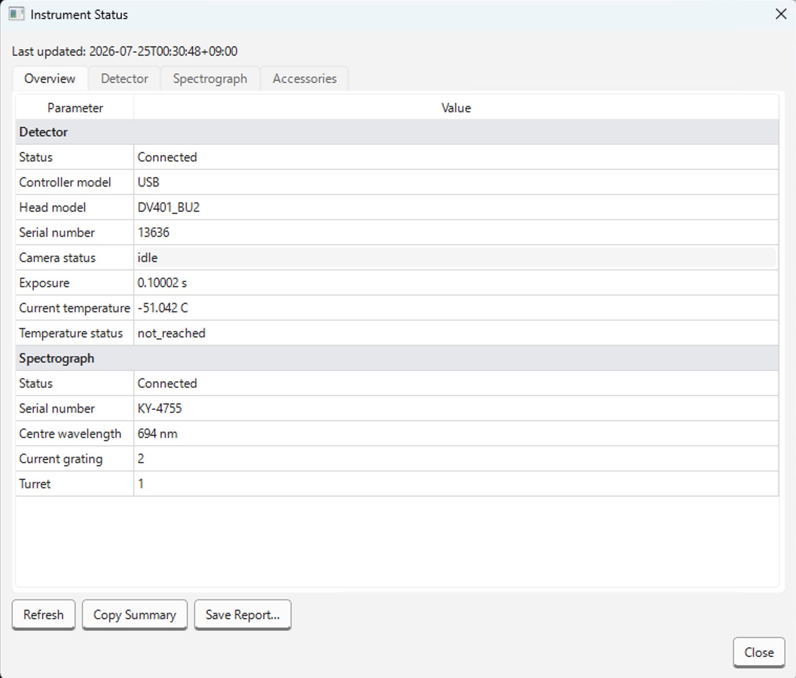
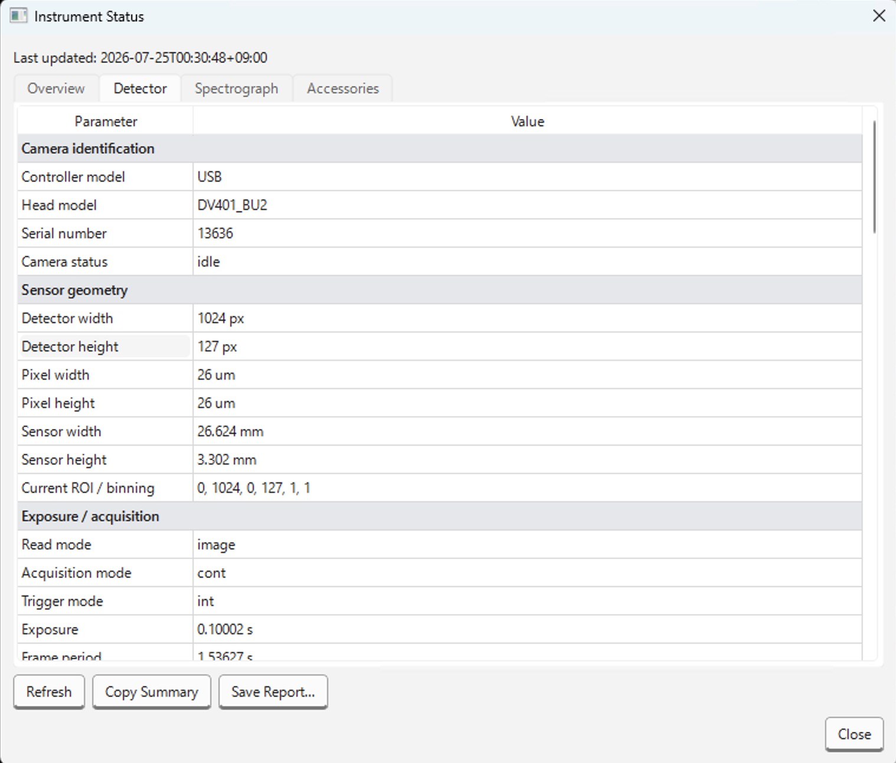
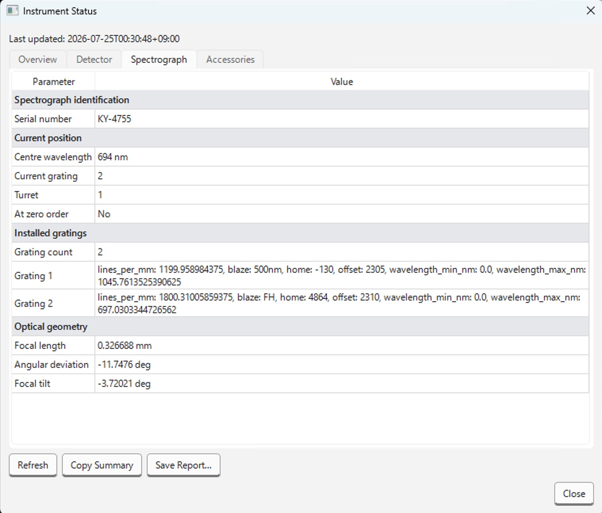
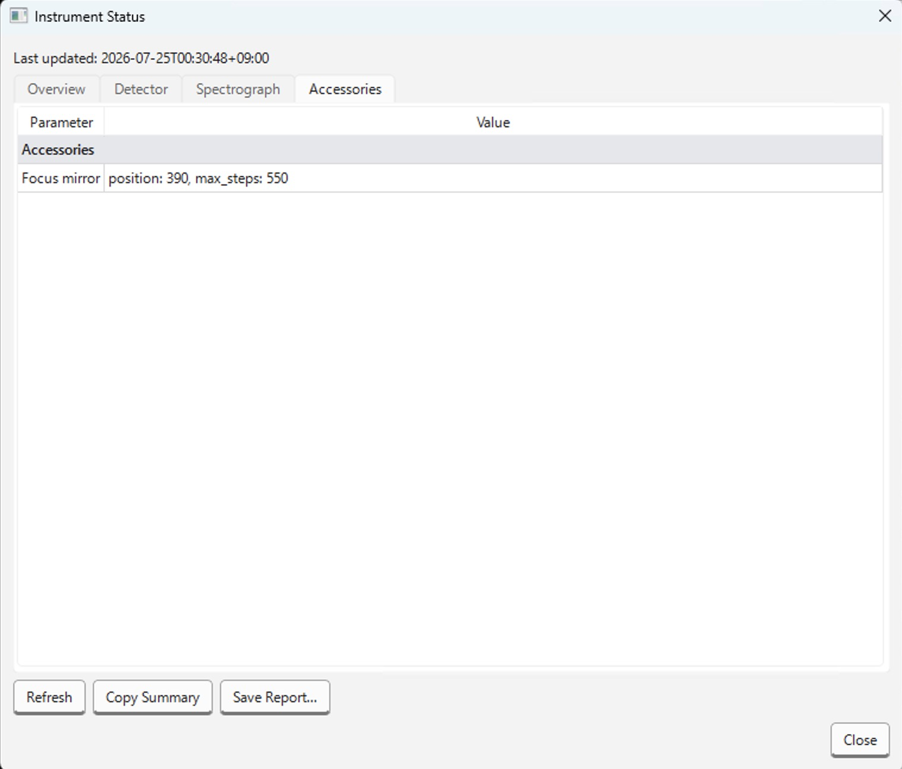

# Instrument Status

接続中のカメラ・分光器の詳細な状態を表示する読み取り専用の
診断ウィンドウです。メイン画面の測定・設定操作には影響しません。

取得に失敗した項目は赤字でエラー内容がツールチップに表示され、その機種がそもそも対応していない項目は灰色（unsupported）で表示されます。

## Overview タブ

カメラ・分光器それぞれの接続状態と、主要項目（機種名、シリアル番号、状態、温度、露光時間、中心波長、回折格子など）を抜粋して表示します。

## Detector タブ

カメラ側の全項目をセクション単位で表示します。

## Spectrograph タブ

分光器側の全項目を表示します。

## Accessories

分光器の「Accessories」セクション（フィルターホイールやシャッターなどが搭載されている場合のみ）だけを表示します。

## 更新のタイミング

状態はウィンドウを開いた瞬間に一度だけ自動取得されます。それ以降は自動更新されないため、
最新の状態を見るには **Refresh** を押す必要があります。測定中または分光器移動中は
**Refresh** が無効化され、「Stop the measurement and wait for spectrograph movement to finish
before refreshing.」と表示されます。

## ボタン

- **Refresh**: カメラ・分光器から状態を再取得します（カメラは即時応答、分光器は別スレッドで
  問い合わせるため、取得中はボタン類が一時的に無効化されます）。
- **Copy Summary**: Overviewに表示されている主要項目をテキストとしてクリップボードにコピーします。
- **Save Report...**: 取得した内容全体をJSONファイルとして保存します（既定ファイル名は
  `instrument-status-<日時>.json`）。

同種の情報をHTTP経由で取得したい場合は[接続機器情報](../../../api/hardware.md)（`GET /hardware/camera`,
`GET /hardware/spectrometer`）を参照してください。
