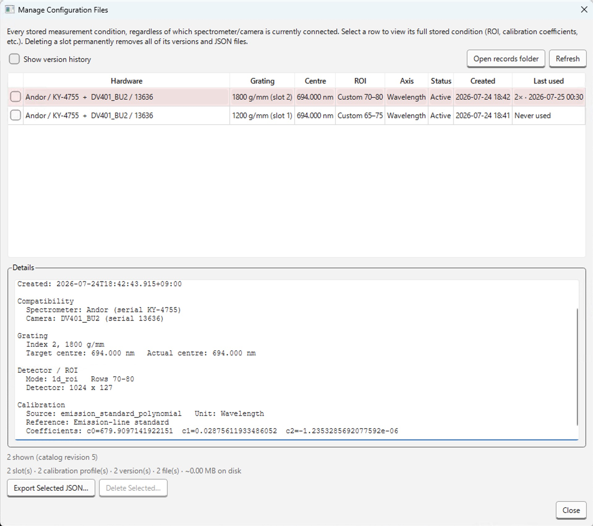

# Manage Configuration Files

**Hardware → Manage Configuration Files...** は、[Configurationファイル](../../../data-formats/configuration.md)として保存されているレコードを、**現在接続中の機種と互換性があるかどうかに関わらず**すべて一覧・削除するためのダイアログです。
ここでは、接続中の機器に対して configuration を適用することはできず、一覧表示・削除・エクスポート専用です。

- 既定では各slotの**active**バージョンのみを表示します。
  **Show version history** をONにすると、archiveされた過去バージョンも含めて表示されます。
- 列は 機種（カメラ／分光器のモデル・シリアル番号） / グレーティング / 中心位置 / ROI / 横軸種別 /状態（Active/Archived） / 作成日時 / 使用回数・最終使用日時 です。
- 今のセッションで読み込み中・位置決め中のconfigurationに該当する行はピンク色で強調表示されます。
- 行を選択すると、Detailsパネルにそのレコードの全項目（slot ID、calibration profile ID、グレーティング、実測中心波長、ROI、較正係数など）がテキストで表示されます。

## ボタン

- **Open records folder**: レコードJSONが保存されているOS別のapplication data領域をファイルマネージャーで開きます。
- **Refresh**: 一覧を再取得します。
- **Export Selected JSON…**: 選択中の行のレコード全体をJSONファイルとして書き出します。
- **Delete Selected…**: チェックを入れた行を削除します（後述）。

## 削除の単位

チェックした行の状態に応じて、削除される範囲が自動的に決まります。

1. **archivedバージョンのみ**: 選択した行がそのslotのactiveバージョンでなければ、その1バージョン（1ファイル）だけが削除されます。
2. **calibration profileごと**: 選択した行がactiveバージョンで、かつ同じslotに他のcalibration profile（例: 同じ物理条件でWavelength較正とRaman shift較正が両方activeな場合）が存在する場合、選択したprofileのバージョンだけが削除され、他のprofileは残ります。
3. **slot全体**: 選択した行がそのslot唯一のactiveプロファイルの場合、そのslotの全バージョン（activeを含む）とファイルがまとめて削除されます。

実行前に確認ダイアログが表示され、それぞれの項目について削除内容が具体的に説明されます。
現在のセッションで読み込み中・位置決め中のconfigurationが含まれる場合は警告文が追加されます。
連続測定中またはAPIサーバー起動中は **Delete Selected…** 自体が無効化されます。

:::note
削除はいずれも取り消せません。
カタログ（`catalog.sqlite3`）とディスク上のJSONファイルの両方から削除されます。
:::
